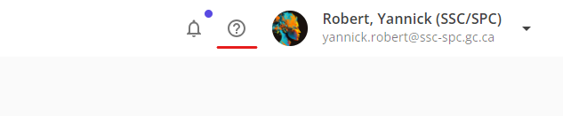
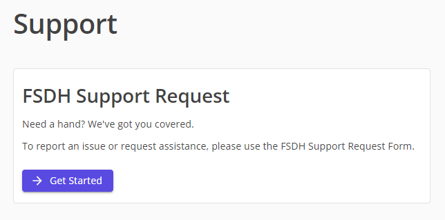
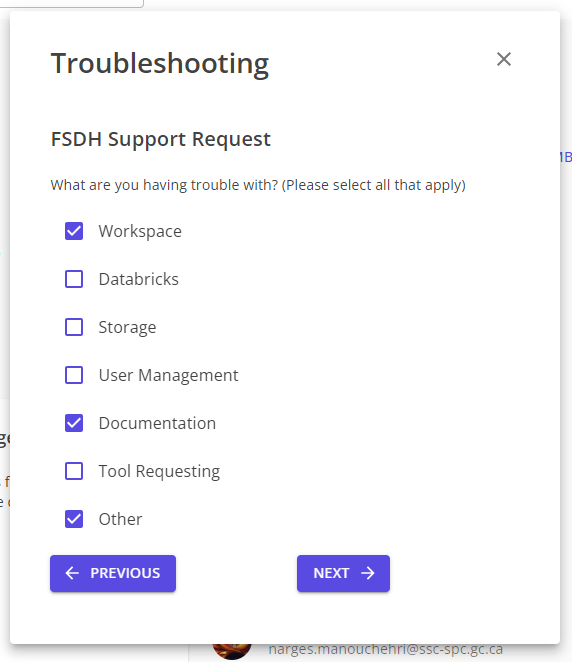
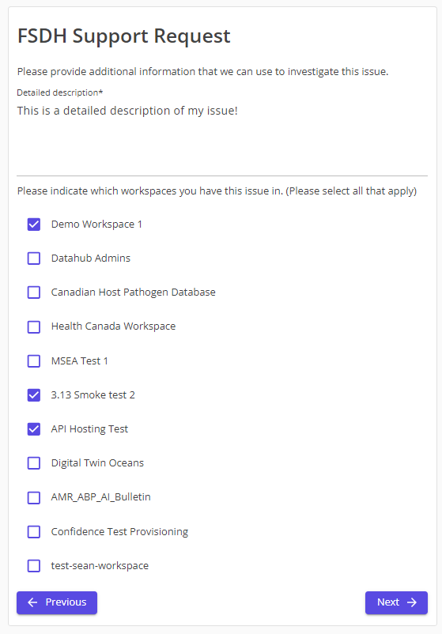
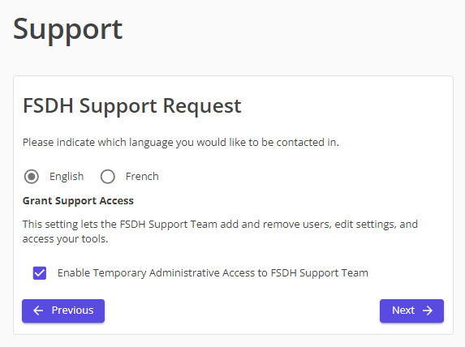
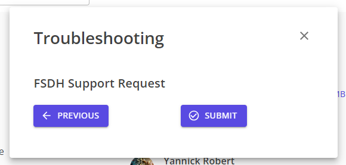

# Request Support

This guide will cover how to log a ticket with the FSDH support team.

1. Click on the `Help` button in the top right corner of the page.
    

1. Click on the `Get Started` button in the FSDH Support Request section.
    

1. Select all the options that apply to your issue and click `Next`.
    

1. Write a short description detailing your issue, select all workspaces that apply, and click `Next`.
    

1. Indicate the language you would like to receive support in and click `Next`.
    

1. Click `Submit` to submit your request.
    