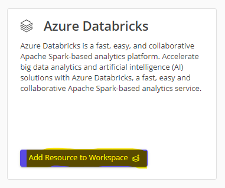
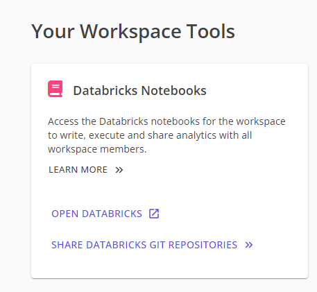

# Request Databricks

This guide will cover how to request a Databricks resource in your workspace.

> **Note:** You can only request cloud resources once you have completed your workspace metadata.

1. Navigate to your workspace.
1. Click on the `Request New` button in the Tools Catalogue section at the bottom of the page.
    

1. Wait for the resource to be provisioned.
    

1. Once the resource is provisioned, click on the `Open Databricks` button in your workspace tools section to open the resource.
    
