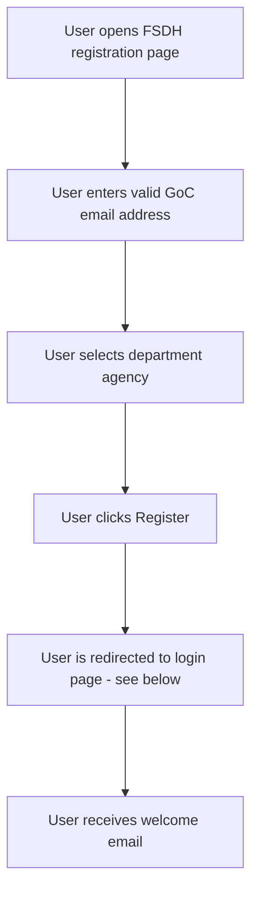
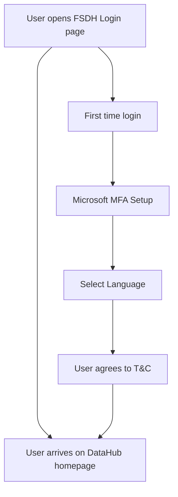
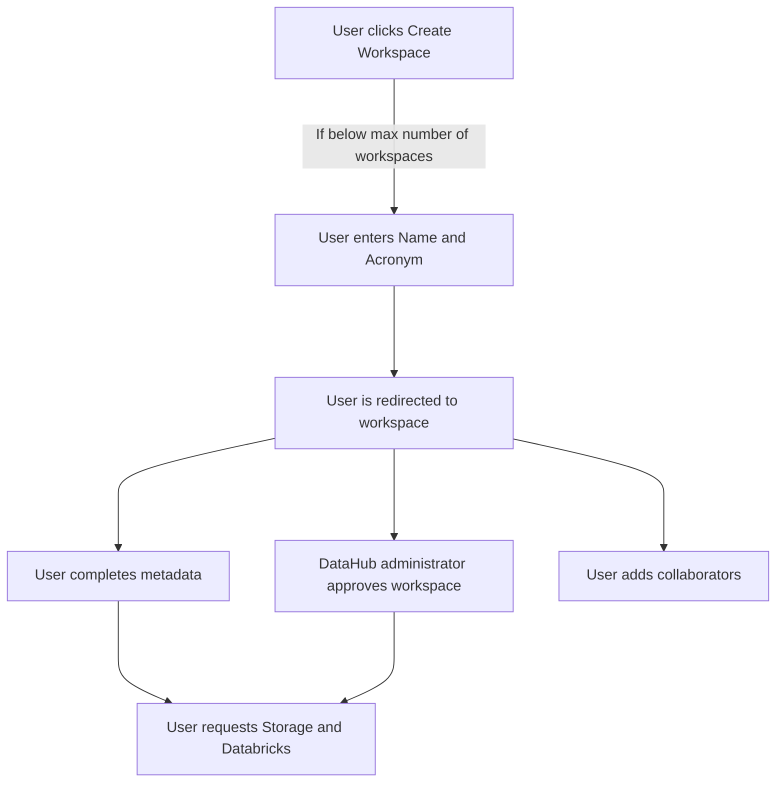
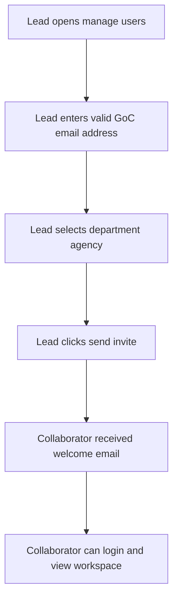
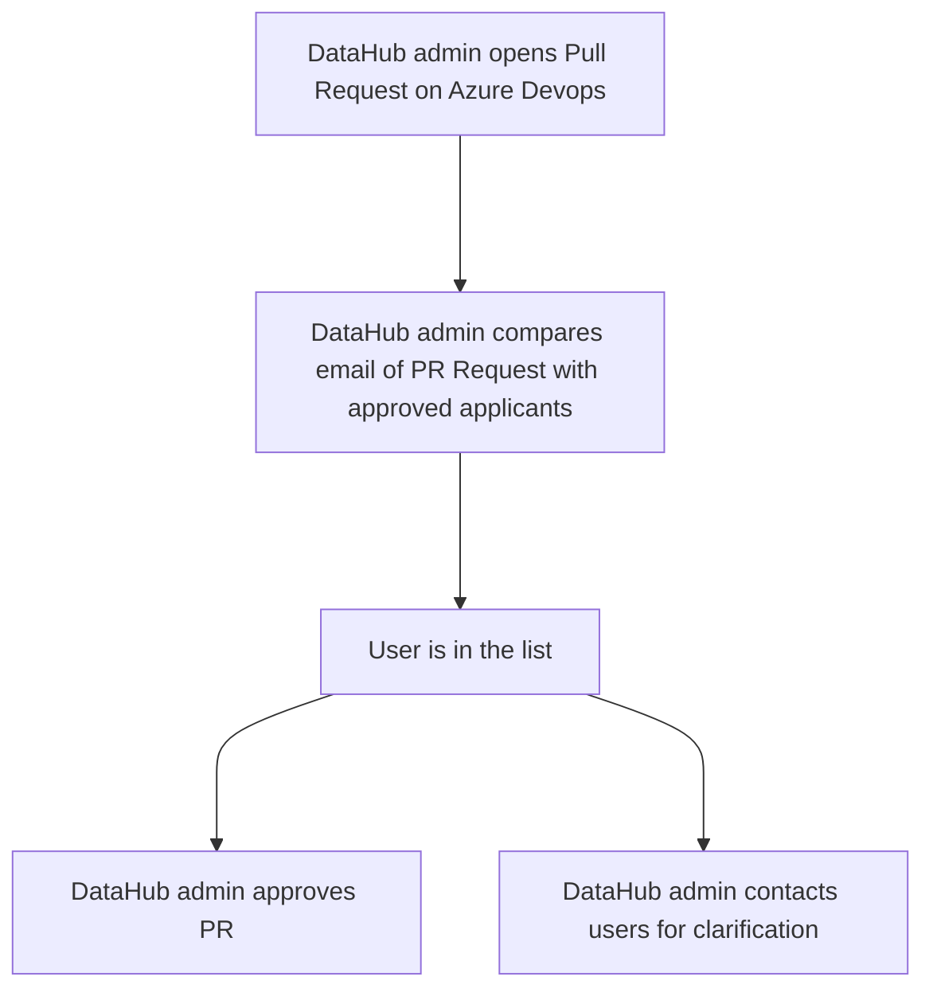

# Onboarding

## Registration workflow

```mermaid
flowchart TD
    A[User opens FSDH registration page]
    B[User enters valid GoC email address]
    C[User selects department agency]
    D[User clicks Register]
    E[User is redirected to login page - see below]
    F[User receives welcome email]
    A ---> B
    B ---> C
    C ---> D
    D ---> E    
    E ---> F
```

## Login

```mermaid
flowchart TD 
    A[User opens FSDH Login page]
    B[First time login]
    C[Microsoft MFA Setup]
    D[Select Language]
    E[User agrees to T&C]
    F[User arrives on DataHub homepage]
    A ---> B
    B ---> C
    A ---> F
    C ---> D
    D ---> E
    E ---> F

```

## Create workspace

```mermaid
flowchart TD
    A[User clicks Create Workspace]
    B[User enters Name and Acronym]
    C[User is redirected to workspace]
    D[User completes metadata]
    E[DataHub administrator approves workspace]
    F[User requests Storage and Databricks]
    G[User adds collaborators]
    A ---> |If below max number of workspaces|B
    B ---> C
    C ---> D
    C ---> E
    C ---> G
    D ---> F
    E ---> F
```

## Invite workflow

```mermaid
flowchart TD
    A[Lead opens manage users]
    B[Lead enters valid GoC email address]
    C[Lead selects department agency]
    D[Lead clicks send invite]
    E[Collaborator received welcome email]
    F[Collaborator can login and view workspace]
    A ---> B
    B ---> C
    C ---> D
    D ---> E
    E ---> F
```

### Datahub administrator approval workflow

```mermaid
flowchart TD 
    A[DataHub admin opens Pull Request on Azure Devops]
    B[DataHub admin compares email of PR Request with approved applicants]
    C[User is in the list]
    D[DataHub admin approves PR]
    E[DataHub admin contacts users for clarification]
    A ---> B
    B ---> C
    C ---> D
    C ---> E
```
