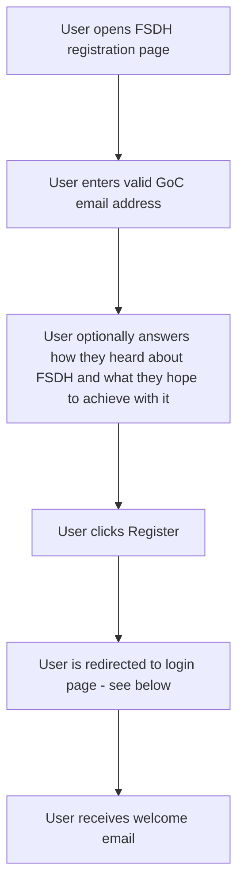
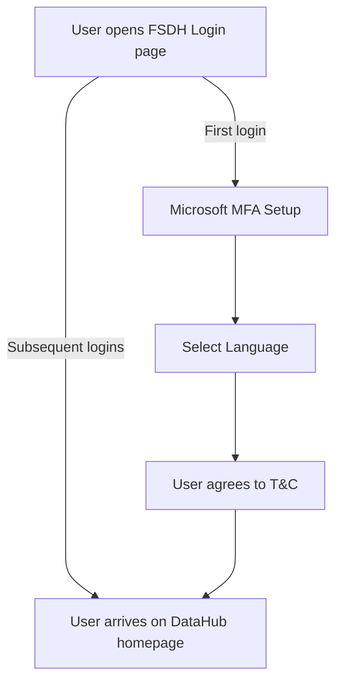
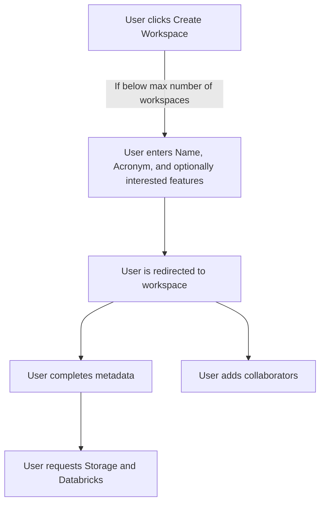
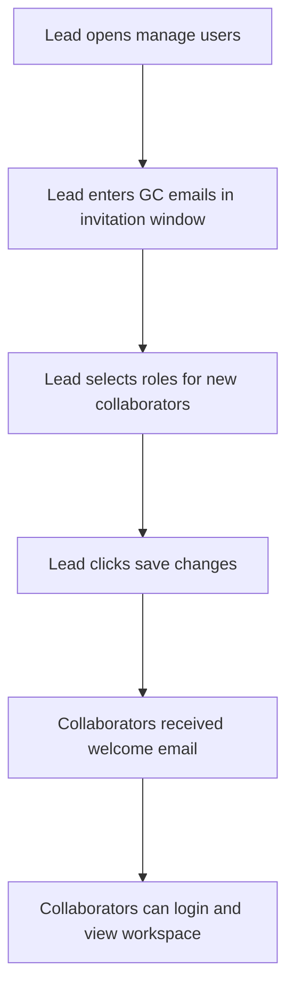

# Onboarding

## Questions

### Registration

- [Text Input] Email address
- [Text Area] (Optional) How did you hear about FSDH and what are you hoping to achieve with it?

### Workspace

> Note: A user can only be the Workspace Lead for up to 3 workspaces.

- [Text Input] Workspace name
- [Text Input] Workspace acronym
- [Multi Select] Which features are of interest to you? (Select all that apply)
  - [x] Storage
  - [ ] Analytics
  - [x] Collaboration
  - [ ] Other

## Registration workflow

## Login

## Create workspace

## Invite workflow
