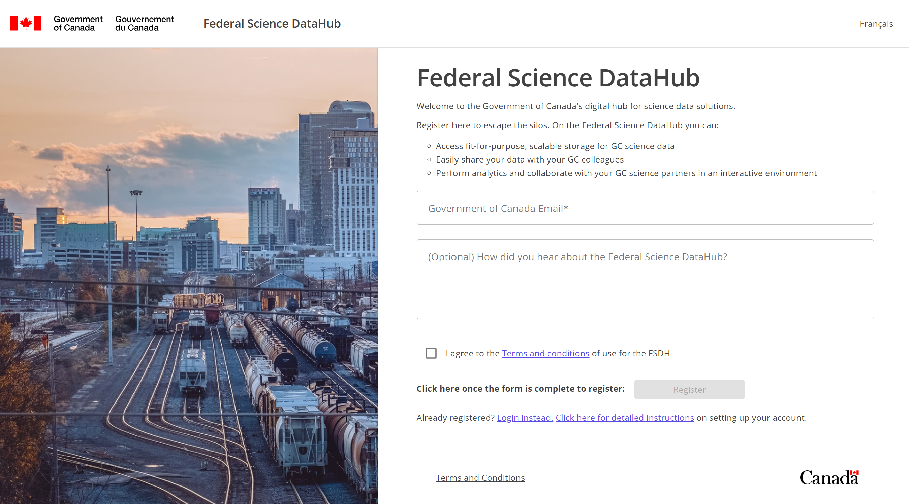
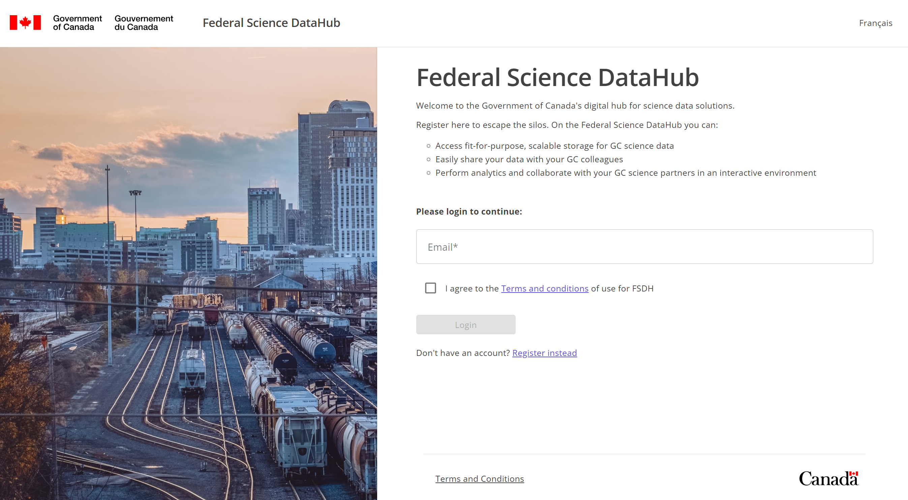

# Registration and Setup

This will guide you through the process of registering and setting up your account for the Federal Science Data Hub (FSDH).

## Account Registration

*View of the registration page.*

1. Using a modern browser (Edge or Chrome) navigate to the FSDH registration page at [https://federal-science-datahub.canada.ca/register](https://federal-science-datahub.canada.ca/register)

1. Enter your Government of Canada email address to register.

1. Read the terms and conditions and click the checkbox to accept them.

1. Click the **Register** button.

> *Note: If you have already registered, you can click the **Login instead** link to navigate to the login page.*

## Account Setup

*View of the login page.*

1. If you have an FSDH account, click the **Login** button to be redirected to your departmental login page.
    > *Note: If you have not registered, you can click the **Register instead** link to navigate to the registration page.*

1. Select your Government of Canada account to login. 
    

1. Read and accept the permissions required by the FSDH application in our Azure Tenant `163Oxygen`.
    

1. Wait for the next prompt to appear.
    

1. Click `Next`
    

1. Input your Government of Canada email address and your M365/Teams password.
    > *Note: Some organizations use your network password as your M365/Teams password. If you are unsure, please contact your IT department.*
    

## Multi-Factor Authentication

### Setup Microsoft Authenticator App

> *Note: If don't currently use the Microsoft Authenticator app, you can skip this section to setup alternative methods to verify your account.*

1. Click `Next` to continue.
    

1. Click `Next` to continue.
    

1. Scan the QR code with the Microsoft Authenticator app.
    

1. Verify prompt in the Microsoft Authenticator app.
    

1. Click `Next` to continue.
    

1. Click `Done` to complete Multi Factor Authentication setup.
    

### (Optional) Setup Alternate MFA Methods

1. Click the `I want to use a different authenticator app` link.
    

1. Select your preferred method of MFA and click `Next`.
    

    > *Note: This section will cover setting up MFA with a phone number. If you choose to use a different method, please follow the on-screen instructions.*

1. Input a phone mobile number (work or personal) that can receive SMS messages and click `Next`.
    

1. Input the code received via SMS to the phone number provided previously and click `Next`.
    

1. Confirm SMS verification and click `Next`.
    

1. Phone MFA setup is complete. Click `Done` to continue.
    

## Sign In

Once you have completed the registration and MFA setup process, you can sign in to the FSDH application.

1. (Optional) Click `Yes` to stay signed in.
    

1. Select your language of preference (English or French) from the dropdown and click `Save`.
    

1. Click on the `Terms and Conditions` link to review the terms and conditions. Check the box to accept the terms and conditions and click `Complete`.
    

> *Note: Important reminder that the FSDH is only approved for **unclassified** data*.
