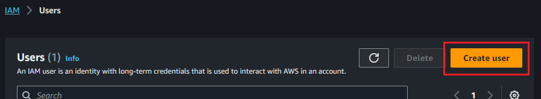
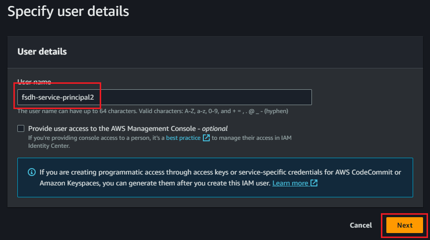
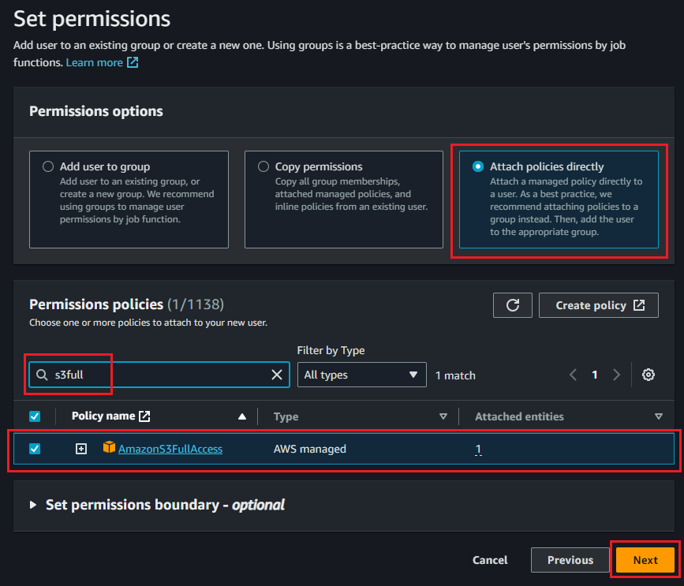
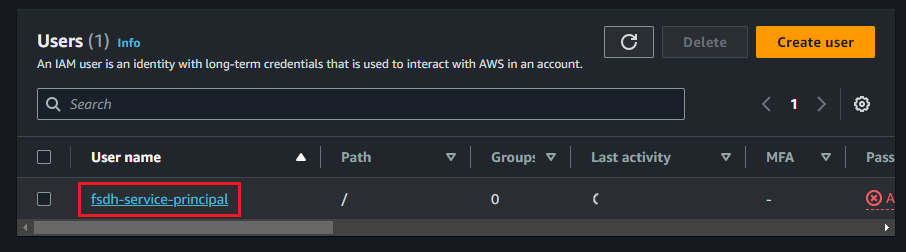
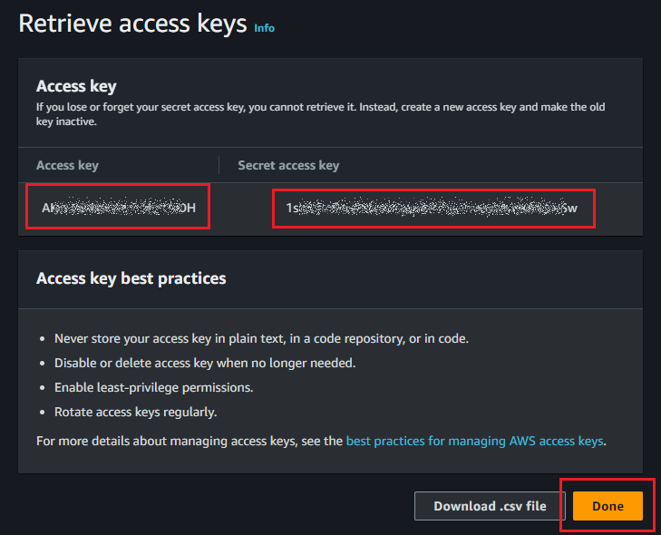

# Importing an Existing AWS S3 Bucket

To import an AWS S3 bucket, you will need to create a user with the appropriate permissions on the bucket, and generate an access key for that user.

1. Using the **Services** menu in the AWS console, navigate to **Security, Identity & Compliance**, and **IAM** under that section.  


2. In the **Users** section, create a new user.  




3. In the **Set permissions** step of user creation, assign an appropriate policy to the user. **AmazonS3FullAccess** will give full rights to the user, but a more restrictive policy such as the example below may be more appropriate for your organization.  
  
```
{
    "Version": "2012-10-17",
    "Statement": [
        {
            "Effect": "Allow",
            "Principal": "*",
            "Action": [
                "s3:GetObject",
                "s3:PutObject",
                "s3:DeleteObject",
                "s3:ListBucket"
            ],
            "Resource": [
                "arn:aws:s3:::<your-bucket-name>/*",
                "arn:aws:s3:::<your-bucket-name>"
            ]
        }
    ]
}
```
After reviewing the information, click **Create user** to complete this step.  


4. Once the user is created, find it in the Users list and click on the username. In  the **Summary** section, under **Access key 1**, click **Create access key**  



5. Select **Other** as the use case. Optionally, set a description for the key to easily identify it, and click **Create access key**  


6. Once the key is created, make sure to copy the **Access key** and **Secret access key**. You will not be able to retrieve the secret key after exiting from this screen and will have to create a new one if you lose it.  


You can now enter this information, along with the bucket name and region, into the configuration dialog in Datahub.  

