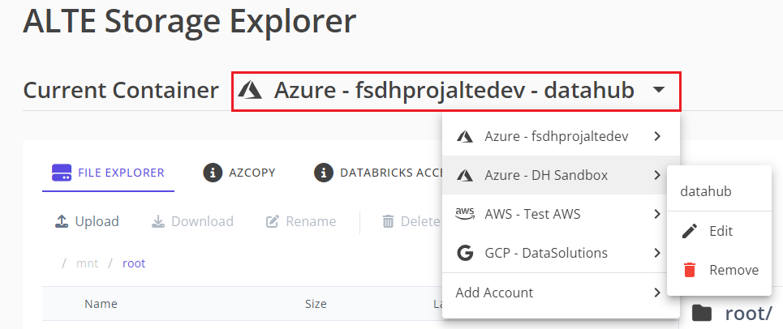
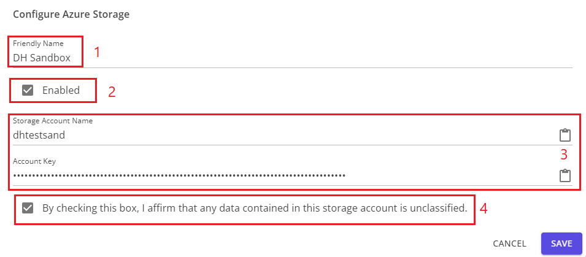

# Import Storage

In addition to the default Azure storage account generated for each workspace, external storage accounts can be imported. This allows users to access those resources in Datahub using Storage Explorer.

Workspace administrators have access to menu options in the storage selector to add, edit and delete cloud storage accounts in addition to the default Azure storage container for the workspace.  

Non-admin users will see a similar menu if the workspace has more than one storage container available. They can navigate between storage containers, but do not have the ability to manage them. If only the default container is available in the workspace, the menu is omitted.  

## Storage Account Configuration

When you add or edit a storage account, you will see this dialog:  

1. The **Friendly Name** will show in the storage selector if it is set. Otherwise, the storage selector and menu will show the account name (Azure, GCP) or bucket name (AWS).
2. The account must be **Enabled** in order to use it in the file explorer. Newly added accounts are enabled by default, but if there is an error accessing the account they will be automatically disabled and must be re-enabled by an administrator.
3. The connection credentials are specific to each cloud service provider. Please select the specific guides for each cloud provider from the sidebar for details.
4. Before adding a cloud storage provider, you must affirm that it does not contain any classified data by checking this checkbox.
