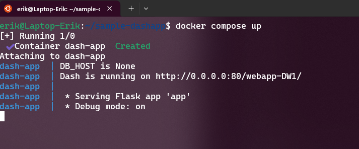

# Recommended Development Environment for web applications

## Option 1: Setup a local laptop for development

This option is recommended for users familiar with:
- linux command lines
- linux package installation

### Install Windows Subsystem for Linux 

See official documentation [How to install Linux on Windows with WSL](https://learn.microsoft.com/en-us/windows/wsl/install)

This step will require administrative priliveges on your computer and you might need to contact your service desk. 

### Install the most recent Docker engine on Ubuntu WSL

We recommend using the [Install using the apt repository](https://docs.docker.com/engine/install/ubuntu/#install-using-the-repository) method to install the docker engine. 

Also we recommend allowing the default user to launch docker
```bash
sudo usermod -a -G docker $USER
```

It might be necessary to log out and back in into WSL for all docker privileges to be setup.

### Install source control tools

If your repository is hosted in GitHub, we recommend installing the GitHub CLI tools to easily be able to pull and push code chanages from your local laptop.

See [Debian, Ubuntu Linux, Raspberry Pi OS (apt)](https://github.com/cli/cli/blob/trunk/docs/install_linux.md) for installation instructions.

### Authorize GitHub

We recommend linking the local Linux installation in WSL with your GitHub credentials to easily pull/push changes.

```bash
gh auth login
```

This prompt will provide a link and ask a code from GitHub to complete the secure authentication.

### Clone repository with GitHub CLI

Replace `<repo>` with your URL, e.g. https://github.com/ssc-sp/datahub-demos

```bash
gh repo clone <repo>
```

### Setup DataHub secrets

The example demo scripts require Powershell to connect with Azure and load the secrets. Powershell can be installed on linux through APT, see [Installing PowerShell on Ubuntu](https://learn.microsoft.com/en-us/powershell/scripting/install/install-ubuntu?view=powershell-7.4)

#### WSL Utilities

Also WSL utilities might be required to let you login in Azure. See [utilities for WSL](https://wslutiliti.es/wslu/install.html#ubuntu). Without this, the linux WSL system won't be able to open a browser window to let you authenticate.

```bash
sudo add-apt-repository ppa:wslutilities/wslu
sudo apt update
sudo apt install wslu
```

#### Copy cloud secrets into local vault

```bash
./load-secrets.ps1
```

This script will authenticate in FSDH Azure and will load into environment variables the secrets from the FSDH Azure Keyvault which will enable your local application to connect to databases and storage accounts.

### Run the web application

Once the prerequistes are setup and secrets are configured, the docker compose image can be started locally.

```
docker compose up
```

For the sample FSDH application, the output should be similar to this



The application can then be opened on a browser locally on http://127.0.0.1/webapp-DW1/

## Option 2: Use GitHub cloud and Codespaces

