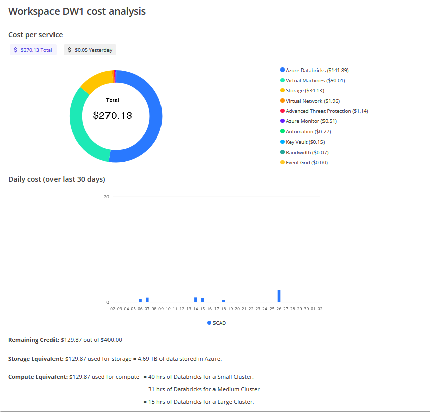

# FSDH Workspace Cost Monitoring

Your FSDH workspace contains a certain amount of credits that are consumed through storage or data analysis. It is important to monitor these costs.

To monitor your credit use:

1. Navigate to the workspace where you want to monitor costing.

1. Near the top of the page, click the total spending indicator, as shown below.
    

1. You can now see a detailed breakdown of costing on your workspace, including current usage, daily usage, and your remaining credits (with estimates for how you can use them).
    

> **Note:** Whenever you run a new workload on DataHub, you should verify the credit consumption.