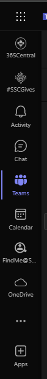
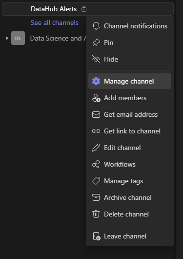
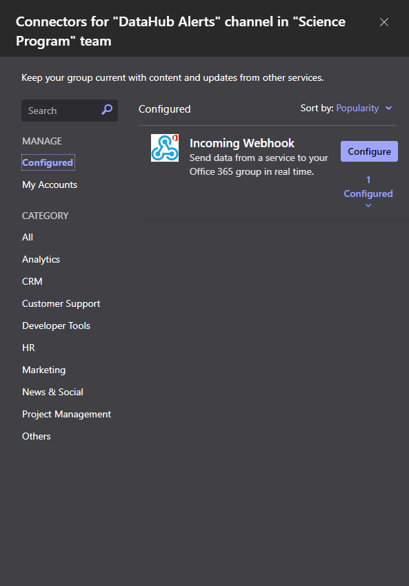
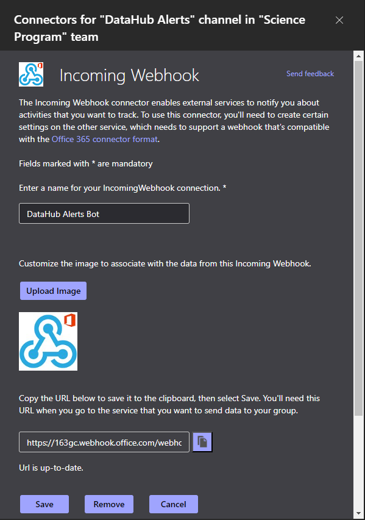

# Configuration du canal des équipes

Pour recevoir des alertes via Teams, un canal Teams doit être configuré avec un connecteur Incoming Webhook. Ensuite, le service (par exemple, la fonction d'alerte sanitaire) doit être configuré avec l'URL du webhook.

## Création du canal

1. Sélectionnez l'onglet **Équipes** dans le menu de gauche. 		
	
1. Cliquez sur le menu **Plus d'options** (trois points) à côté de l'équipe souhaitée.
	
1. Dans le menu, sélectionnez **Ajouter un canal**.
	
1. Saisissez les informations relatives au nouveau canal et cliquez sur **Créer** lorsque vous avez terminé.
	
1) (facultatif) Ajouter des membres au canal. Les membres ayant le rôle de **Propriétaire** auront plus de privilèges dans le canal, y compris l'ajout d'autres membres et la gestion des connecteurs.
	

## Configuration du connecteur Webhook
1. Dans le menu **Plus d'options** (trois points) à côté du nom du canal dans le menu de gauche, ou **Plus d'options du canal** en haut à droite de la fenêtre avec le canal, sélectionnez **Gérer le canal** pour afficher l'écran de gestion du canal.
	 
1. Dans l'onglet **Paramètres**, développez la catégorie **Connecteurs** et cliquez sur **Modifier**
	
1. Trouvez "**Incoming Webhook**" dans la liste des connecteurs disponibles et cliquez sur **Configurer**. Si votre liste contient trop d'éléments pour que vous puissiez la trouver facilement, vous pouvez la filtrer en saisissant "webhook" dans le champ de recherche situé à gauche.
	
1. Saisissez un nom et, éventuellement, téléchargez une image pour le connecteur webhook, puis cliquez sur **Create** pour créer le connecteur. Ce connecteur sera l'"auteur" des alertes qui seront publiées sur le canal.
	
1. Après quelques instants, le connecteur sera créé et une zone de texte contenant son URL s'affichera au bas de la boîte de dialogue. L'URL peut être copiée à partir de là. Pour les alertes du bilan de santé, elle devra être saisie dans la configuration de l'application de fonction avec la clé **BugReportTeamsWebhookUrl**.
	

## Configuration d'un connecteur Webhook existant
1. Ouvrez la liste des connecteurs en accédant à l'écran de gestion des canaux comme indiqué ci-dessus, puis en cliquant sur Edit (Modifier) dans la catégorie Connectors (Connecteurs) de l'onglet Settings (Paramètres). Sur cet écran, sélectionnez "**Configuré**" sous l'en-tête Manage (Gérer) à gauche.
	
1. Développez la liste *(n) Configured* (1 dans ce cas) sous le connecteur Incoming Webhook pour voir la liste des connecteurs webhook existants dans ce canal. Cliquez sur **Manage** à côté de celui que vous souhaitez configurer.
	
1. Les paramètres de ce connecteur s'affichent. À partir de là, vous pouvez mettre à jour le nom et l'image, trouver l'URL pour les messages entrants ou supprimer le connecteur.
	
