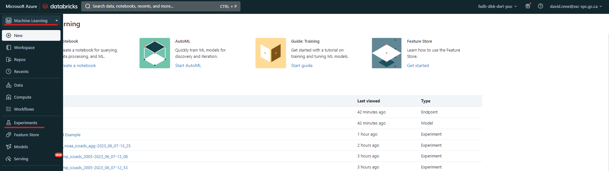
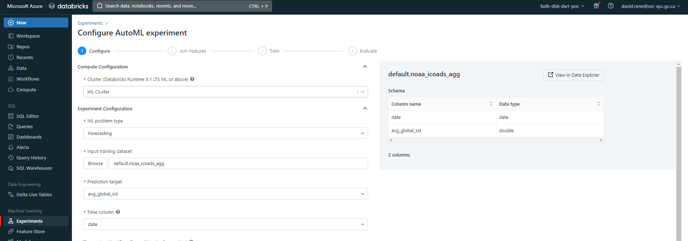
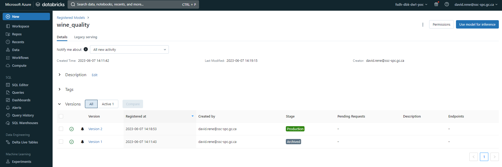

**Databricks MLFlow : AutoML et expériences**

<video width="600" height="350" controls>
    <source src="/api/media/experiments-automl.mp4" type="video/mp4">
    Votre navigateur ne prend pas en charge la balise vidéo.
</video>

Databricks MLFlow est une plateforme intégrée pour le cycle de vie de l'apprentissage automatique de bout en bout. Elle offre un lieu centralisé pour suivre les expériences, gérer les modèles et les déployer rapidement en production. MLflow vous permet d'enregistrer et d'interroger des expériences à l'aide des API Python, REST, R et Java. Vous pouvez utiliser MLflow pour enregistrer et interroger des expériences, obtenir des métriques d'exécution, l'historique des métriques et comparer les exécutions. MLflow est une API et une interface utilisateur permettant d'enregistrer les paramètres, les versions de code, les métriques et les fichiers de sortie lors de l'exécution de votre code d'apprentissage automatique et de visualiser ultérieurement les résultats.

MLflow est organisé autour du concept de **runs**, qui sont des exécutions de code de science des données. Les runs sont agrégés en **expériences** où de nombreux runs peuvent faire partie d'une expérience donnée et un serveur MLflow peut héberger de nombreuses expériences. Le composant MLflow est une API et une interface utilisateur pour l'enregistrement des paramètres, des versions de code, des métriques et des fichiers de sortie lors de l'exécution de votre code d'apprentissage automatique et pour la visualisation ultérieure des résultats.

Dans Databricks, il existe deux types d'expériences :

- Les expériences de l'espace de travail** sont des expériences qui sont créées et gérées dans l'espace de travail Databricks. Vous pouvez utiliser l'interface utilisateur des expériences Databricks pour visualiser et gérer ces expériences. Vous pouvez également utiliser l'API MLflow pour enregistrer les exécutions de ces expériences.
- Les expériences de type notebook** sont des expériences créées et gérées dans un notebook. Vous pouvez utiliser l'API MLflow pour enregistrer les exécutions de ces expériences. Vous pouvez également utiliser l'interface utilisateur des expériences Databricks pour visualiser et gérer ces expériences.

## **Expériences d'espace de travail et AutoML**

Les expériences de l'espace de travail tirent parti d'AutoML, une fonctionnalité de Databricks qui entraîne et ajuste automatiquement les modèles d'apprentissage automatique. Cela permet à l'utilisateur de construire des modèles d'apprentissage automatique avec un minimum d'effort et pratiquement sans codage. Cette fonctionnalité est une option prête à l'emploi pour Databricks et offre une variété d'algorithmes à choisir :

- Classification** : Régression logistique, forêt aléatoire, arbre de décision, XGBoost, LightGBM
- Régression** : Arbre de décision, forêt aléatoire, régression linéaire avec descente de gradient stochastique, XGBoost, LightGBM
- **Prévision** : ARIMA, Prophète

En résumé, AutoML entraînera plusieurs modèles en utilisant différents algorithmes et hyperparamètres et sélectionnera le meilleur sur la base de la métrique que vous avez choisie. Il vous fournira également un carnet de notes que vous pourrez utiliser pour déployer votre modèle.

La première étape de l'utilisation d'AutoML consiste à télécharger vos données de formation vers Databricks. Vous pouvez le faire en suivant [ce guide] (https://learn.microsoft.com/fr-ca/azure/databricks/ingestion/add-data/upload-data). Vous aurez également besoin d'un cluster avec un runtime ML.

Une fois que vous avez téléchargé vos données, vous pouvez créer une nouvelle expérience en cliquant sur l'onglet "Expériences" sur le côté gauche de l'écran. Si vous utilisez l'ancienne interface utilisateur, vous devez sélectionner "Machine Learning" dans le menu déroulant en haut à gauche.

Ancienne interface utilisateur :


Nouvelle interface utilisateur :


Une fois que vous avez accédé à la page des expériences, vous pouvez cliquer sur le bouton "Nouvelle expérience" pour créer une nouvelle expérience :


Le menu de création d'expériences s'ouvre alors :



À partir de là, vous pouvez configurer votre expérience. Certaines configurations ne sont disponibles que pour certains types de problèmes de ML. Les configurations sont les suivantes :

- **Cluster** : le cluster que vous souhaitez utiliser pour l'expérience, comme mentionné ci-dessus, il doit s'agir d'un cluster avec un runtime ML et il doit être en cours d'exécution.
- Type de problème LM** : le type de problème que vous essayez de résoudre, qu'il s'agisse de classification, de régression ou de prévision.
- **Input training dataset** : l'ensemble de données que vous souhaitez utiliser pour la formation. Comme mentionné ci-dessus, vos données doivent être disponibles dans la base de données SQL de Databricks.
- Cible de prédiction** : la colonne/caractéristique que vous essayez de prédire.
- **Nom de l'expérience** : le nom de votre expérience.

Il existe également des configurations avancées dans lesquelles vous pouvez spécifier les éléments suivants :


- Métrique d'évaluation** : la métrique que vous souhaitez utiliser pour évaluer votre modèle. Elle sera utilisée pour comparer les modèles et sélectionner le meilleur. La métrique choisie doit être disponible pour le type de problème sélectionné.
- **Cadres de formation** : les cadres que vous souhaitez utiliser pour la formation. En fonction de votre type de problème, vous pourrez choisir dans la liste ci-dessus. Notez que vous pouvez sélectionner plusieurs cadres à la fois.
- **Timeout** : la durée maximale que vous souhaitez accorder à l'apprentissage. Si le temps d'apprentissage dépasse cette valeur, l'apprentissage sera interrompu et le meilleur modèle sera sélectionné.

Ainsi que d'autres configurations.

Une fois que vous avez configuré votre expérience, vous pouvez cliquer sur le bouton "Démarrer AutoML" pour la créer. Vous accéderez alors à la page d'aperçu, où vous pourrez voir la progression de votre expérience :


En haut, vous pouvez voir des informations générales sur votre expérience, un carnet d'exploration des données généré automatiquement et le carnet du meilleur modèle. Vous pouvez également voir le statut de votre expérience et le nombre de modèles qui ont été formés jusqu'à présent. En bas, vous pouvez voir plus d'informations sur les modèles qui ont été formés, y compris le nom du modèle, le cadre utilisé, le temps de formation, la valeur métrique et le statut.

Une fois votre expérience terminée, vos modèles seront triés en fonction de la métrique d'erreur que vous avez choisie, et vous pourrez alors sélectionner le meilleur modèle dans la liste. En cliquant dessus, vous pouvez enregistrer le modèle :


Vous serez invité à choisir un nom pour votre modèle, puis vous pourrez cliquer sur `Create`.

À partir de ce moment, le modèle que vous avez créé sera accessible à toute personne à laquelle vous aurez donné des autorisations dans l'onglet "Modèles" sur le côté gauche de l'écran :


En cliquant sur un modèle enregistré, vous pourrez en voir les détails :



A partir de là, vous pouvez définir son stade, comme `Production`, `Staging` ou `Archivé`. Vous pouvez aussi voir l'historique des versions du modèle, qui vous montrera les différentes versions du modèle qui ont été créées. Vous pouvez également voir la lignée du modèle, qui vous montrera les différentes expériences qui ont été utilisées pour créer le modèle.

En outre, vous pouvez cliquer sur "Utiliser le modèle pour l'inférence" pour générer automatiquement des carnets de notes qui peuvent être utilisés pour utiliser le modèle pour inférer ou appliquer automatiquement le modèle à tous les ensembles de données disponibles.

Vous avez réussi à créer un modèle à l'aide d'AutoML et à l'enregistrer en vue d'une utilisation ultérieure, sans écrire de code !

## **Expériences sur le carnet de notes**

Les expériences dans un carnet sont des expériences créées et gérées dans un carnet. Elles sont idéales si vous avez besoin d'un code d'apprentissage automatique très spécifique et si vous devez effectuer un prétraitement ou un post-traitement.

``python
# mlflow.start_run crée une nouvelle exécution MLflow pour suivre les performances de ce modèle.
# Dans le contexte, vous appelez mlflow.log_param pour garder une trace des paramètres utilisés, et vous appelez mlflow.log_param pour garder une trace des paramètres utilisés.
# mlflow.log_metric pour enregistrer des mesures telles que la précision.
avec mlflow.start_run(run_name='untuned_random_forest') :
  n_estimateurs = 10
  model = RandomForestClassifier(n_estimateurs=n_estimateurs, random_state=np.random.RandomState(123))
  model.fit(X_train, y_train)

  # predict_proba renvoie [prob_negative, prob_positive], donc découpez la sortie avec [ :, 1]
  predictions_test = model.predict_proba(X_test)[ :,1]
  auc_score = roc_auc_score(y_test, predictions_test)
  mlflow.log_param('n_estimators', n_estimators)
  # Utiliser l'aire sous la courbe ROC comme métrique.
  mlflow.log_metric('auc', auc_score)
  wrappedModel = SklearnModelWrapper(model)
  # Enregistrer le modèle avec une signature qui définit le schéma des entrées et sorties du modèle.
  # Lorsque le modèle est déployé, cette signature sera utilisée pour valider les entrées.
  signature = infer_signature(X_train, wrappedModel.predict(None, X_train))

  # MLflow contient des utilitaires pour créer un environnement conda utilisé pour servir les modèles.
  # Les dépendances nécessaires sont ajoutées à un fichier conda.yaml qui est enregistré avec le modèle.
  conda_env = _mlflow_conda_env(
        additional_conda_deps=None,
        additional_pip_deps=["cloudpickle=={}".format(cloudpickle.__version__), "scikit-learn=={}".format(sklearn.__version__)],
        additional_conda_channels=None,
    )
  mlflow.pyfunc.log_model("random_forest_model", python_model=wrappedModel, conda_env=conda_env, signature=signature)
```

Voici un exemple d'utilisation d'expériences à partir de carnets Python. Cet exemple est tiré de la [documentation Databricks] (https://learn.microsoft.com/fr-ca/azure/databricks/mlflow/end-to-end-example).

En ouvrant le contexte `mlflow.start_run`, vous pouvez enregistrer les paramètres et les métriques de l'expérience. Vous pouvez également enregistrer le modèle lui-même ! Cela vous permettra d'enregistrer le modèle pour une utilisation future, comme indiqué dans la section "Expériences du cahier de travail".

L'exécution de ce code créera automatiquement une expérience pour vous, à laquelle vous pouvez accéder dans l'onglet `Expériences` sur le côté gauche de l'écran, et chaque exécution que vous créez sera ajoutée à cette expérience. Vous pouvez également visualiser toutes les expériences que vous avez créées dans un carnet en cliquant sur l'icône `Expériences MLFlow` sur le côté droit de l'écran :


À partir de là, vous pouvez visualiser vos séries, les modèles qui leur sont associés, les paramètres enregistrés et les mesures :


Une fois encore, n'oubliez pas de consulter le [cahier d'exemples de ML de bout en bout] (https://learn.microsoft.com/fr-ca/azure/databricks/mlflow/end-to-end-example) ainsi que la [documentation de l'API MLFlow] (https://docs.databricks.com/api/azure/workspace/experiments) pour en savoir plus sur la manière d'exécuter des expériences à partir des cahiers d'expériences.

## En savoir plus

- [Documentation Databricks MLFlow] (https://learn.microsoft.com/fr-ca/azure/databricks/mlflow/)
- [Exemple d'expérience dans un carnet de notes] (https://learn.microsoft.com/fr-ca/azure/databricks/mlflow/end-to-end-example)
