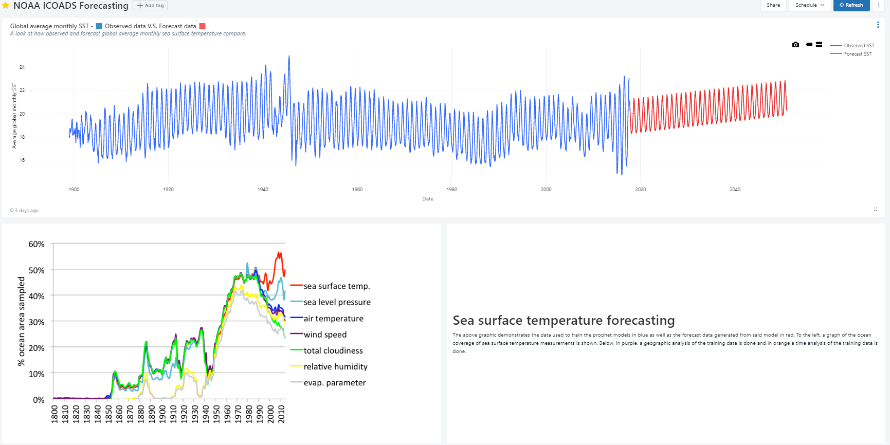
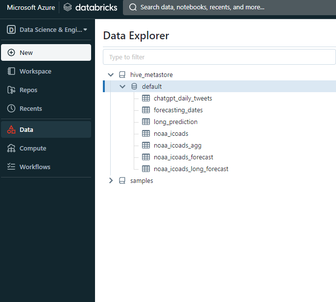
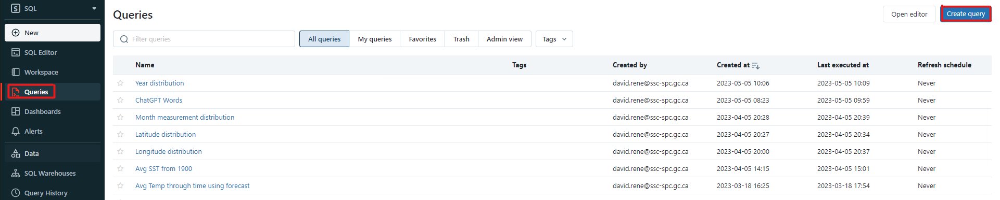

# Comment utiliser les tableaux de bord dans Databricks

## Prérequis

- Connaissance de base de _Structured Query Language_ (SQL)
- Vos données sont stockées sous forme de table(s) dans Databricks.

## Pourquoi créer des tableaux de bord ?

- Ils sont un excellent moyen de visualiser vos données d'une manière facile à comprendre.
- Ils vous permettent de partager facilement vos données avec d'autres personnes (dans votre espace de travail).
- Ils peuvent être exportés sous forme de fichiers PDF afin d'être facilement partagés avec toutes personnes.
- Ils sont dynamiques et peuvent être utilisées pour surveiller vos données en temps réel.
- Ils peuvent être utilisés pour créer une interface utilisateur interactive pour vos données.

## Exemple de tableau de bord

Voici un exemple de tableau de bord créé à l'aide de l'outil de tableau de bord intégré de Databricks pour l'analyse du [National Oceanic and Atmospheric Administration's International Comprehensive Ocean-Atmosphere DataSet](https://icoads.noaa.gov/).




Cet exemple de tableau de bord peut également être visualisé sous forme de [PDF exporté](https://github.com/ssc-sp/datahub-docs/blob/main/UserGuide/Databricks/SampleDashboard.pdf).

Dans le cadre de ce tutoriel, nous allons suivre le processus de création d'un bloc de ce tableau de bord. Tous les blocs suivent un processus similaire.

## 1. Préparer vos données

Avant de pouvoir créer un tableau de bord, vos données doivent être stockées sous forme de table dans Databricks. Si vous ne l'avez pas encore fait, vous pouvez suivre les étapes de la [documentation Databricks](https://docs.databricks.com/data/tables.html#create-a-table) pour créer une table à partir de vos données.

Vos données doivent être visibles dans l'onglet "Données" de votre espace de travail :


## 2. Création d'un tableau de bord

Après avoir défini votre environnement sur "SQL" dans le coin supérieur gauche de votre espace de travail, cliquez sur l'onglet "Tableaux de bord". Cliquez ensuite sur le bouton "Créer un tableau de bord" pour créer un nouveau tableau de bord :


Choisissez un nom approprié pour votre tableau de bord et cliquez sur "Enregistrer". Les tableaux de bord dans Databricks sont constitués de "blocs". Chaque bloc est soit une visualisation, soit une zone de texte, soit un filtre. Vous pouvez ajouter un nouveau bloc en cliquant sur le bouton "Ajouter" dans le coin supérieur droit de votre tableau de bord.

- Les visualisations sont utilisées pour afficher vos données dans un format visuel. Vous pouvez choisir parmi une variété de visualisations différentes telles que les diagrammes à barres, les diagrammes linéaires, les diagrammes circulaires, etc.
- Les zones de texte sont utilisées pour afficher du texte. Vous pouvez les utiliser pour ajouter des titres, des sous-titres, des descriptions, etc. Ces blocs de texte peuvent être formatés à l'aide de Markdown et permettent d'intégrer des images.
- Les filtres sont utilisés pour filtrer vos données. Vous pouvez les utiliser pour filtrer vos données sur la base d'une colonne spécifique ou d'une valeur spécifique.

Au cœur de chaque bloc se trouve une requête SQL. Cette requête est utilisée pour récupérer les données qui seront affichées dans le bloc. Par essence, chaque bloc est une représentation dynamique de vos données qui est mise à jour en temps réel au fur et à mesure que vos données changent.

## 3. Création d'une requête SQL

Dans la barre de navigation, cliquez sur l'onglet "Requêtes" puis sur le bouton "Créer une requête" pour créer une nouvelle requête :



L'éditeur SQL s'ouvre alors. Vous pouvez y écrire votre requête SQL. Pour ce tutoriel, nous allons créer un diagramme à barres qui affiche le nombre d'observations pour chaque année. La requête est la suivante :

```sql
SELECT YEAR(date) AS year, COUNT(sea_surface_temp) AS measurement_count
FROM noaa_icoads
WHERE YEAR(date) > YEAR(DATE("1849-01-01"))
GROUP BY year
ORDER BY year
```

Remarquez que nous utilisons la table `noaa_icoads` que nous avons créée précédemment. Nous utilisons également la fonction `YEAR()` pour extraire l'année de la colonne `date`. En effet, la colonne `date` contient la date au format `YYYY-MM-DD`. Nous utilisons également la fonction `DATE()` pour créer un objet date à partir de la chaîne `"1849-01-01"`. En effet, la fonction `YEAR()` ne fonctionne qu'avec des objets de type date. Nous utilisons la clause `GROUP BY` pour regrouper les données par année et la clause `ORDER BY` pour ordonner les données par année. Nous utilisons les données à partir de 1849 car les données antérieures ne sont pas nécessairement fiables. Cette requête renvoie le tableau suivant :

| year | measurement_count |
| ---- | ----------------- |
| 1850 | 27736             |
| 1851 | 22490             |
| 1852 | 25061             |
| 1853 | 39143             |
| ...  | ...               |

Maintenant que nous avons notre requête, enregistrons-la en cliquant sur le bouton "Enregistrer". Une boîte de dialogue s'ouvre alors, dans laquelle vous pouvez saisir un nom pour votre requête. Saisissez un nom approprié et cliquez sur "Enregistrer".

## 4. Création d'une visualisation

Retournez au tableau de bord que vous avez créé précédemment, cliquez sur les 3 points en haut à droite et cliquez sur "Modifier". L'éditeur de tableau de bord s'ouvre alors. Cliquez sur le bouton "Ajouter" et sélectionnez "Visualisation". Vous êtes invité à sélectionner une requête sauvegardée : sélectionnez la requête que vous avez créée précédemment et cliquez sur "Sélectionner". L'éditeur de visualisation s'ouvre alors. Vous pouvez y sélectionner le type de visualisation que vous souhaitez créer. Pour ce tutoriel, nous allons créer un diagramme à barres. Sélectionnez "Diagramme à barres" et cliquez sur "Sélectionner". L'éditeur de diagramme à barres s'ouvre. Vous pouvez y sélectionner les colonnes que vous souhaitez utiliser pour l'axe des x et l'axe des y. Pour ce tutoriel, nous utiliserons la colonne `year` pour l'axe x et la colonne `measurement_count` pour l'axe y. Sélectionnez les colonnes appropriées et cliquez sur "Appliquer". Cela créera un diagramme à barres. Vous pouvez cliquer sur le bouton "Preview" pour voir un aperçu de votre visualisation. Vous pouvez également cliquer sur le bouton "Editer" pour modifier votre visualisation. Lorsque vous êtes satisfait de votre visualisation, cliquez sur "Enregistrer". Votre visualisation sera alors enregistrée et ajoutée à votre tableau de bord.

Il existe des tonnes d'options de visualisation différentes dans Databricks. Vous devriez les explorer pour trouver celles qui vous conviennent le mieux. L'éditeur de visualisation offre également des tonnes d'options de personnalisation telles que la modification de la couleur des barres, la modification du titre, etc. Vous pouvez également ajouter des visualisations provenant de différents tableaux à un seul tableau de bord, ce qui vous permet de comparer des données provenant de différents tableaux.

## 5. Finalisation du tableau de bord

Vous pouvez ajouter autant de blocs que vous le souhaitez et vous pouvez les arranger et les redimensionner comme bon vous semble. Vous pouvez également ajouter des zones de texte et des filtres à votre tableau de bord, ainsi que des thèmes de couleurs. Une fois que vous êtes satisfait de votre tableau de bord, cliquez sur le bouton "Modification terminée".

En cliquant sur les trois points en haut à droite, vous pouvez également exporter votre tableau de bord au format PDF, le partager avec d'autres personnes ou le supprimer.

Voici un autre exemple amusant de tableau de bord créé à l'aide de l'outil de tableau de bord intégré de Databricks :


Il s'agit d'un nuage de mots représentant les mots les plus fréquemment utilisés dans les tweets contenant le mot "ChatGPT" sur twitter un jour donné. Les données proviennent de [Kaggle datasets](https://www.kaggle.com/datasets/edomingo/chatgpt-1000-daily-tweets).

## [Plus d'informations sur les tableaux de bord Databricks](https://learn.microsoft.com/en-us/azure/databricks/lakehouse/data-objects)
