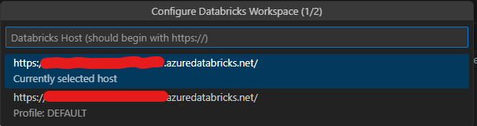
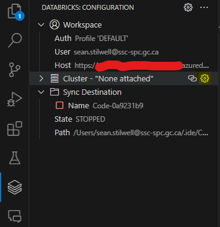
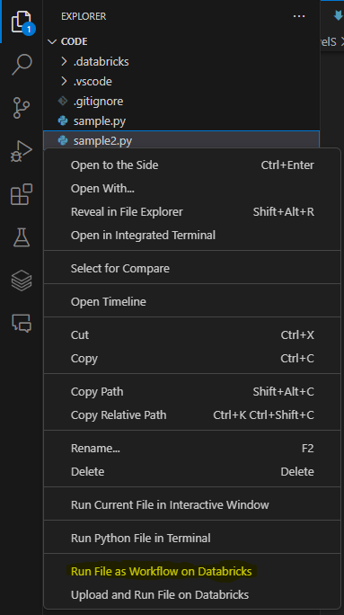

# Databricks VS Code Extension

## Pourquoi l'utiliser ?

Visual Studio Code est un éditeur de code extrêmement populaire. En tant que système open source, il dispose d'une large communauté de contributeurs et d'utilisateurs. Il est également très extensible, ce qui permet aux utilisateurs d'installer une grande variété d'extensions pour prendre en charge différents langages de programmation, le débogage, etc.

Grâce à l'extension Databricks VS Code, vous pouvez vous connecter à un espace de travail Databricks à partir de VS Code. Cela vous permet de :

* Ecrivez votre code localement dans VS Code, puis exécutez-le à distance sur un cluster Databricks.
* Exécuter des requêtes SQL sur un cluster Databricks et voir les résultats directement dans VS Code.
* Gérer vos clusters Databricks.

## Conditions préalables

* [Visual Studio Code](https://code.visualstudio.com/).
* Un espace de travail Databricks sur le DataHub scientifique fédéral.

## Installer l'extension

1. Ouvrez Visual Studio Code.
1. Cliquez sur l'icône **Extensions** dans la barre de navigation de gauche.
1. Recherchez **Databricks**.
1. Cliquez sur **Install**. L'extension correcte est indiquée dans la capture d'écran ci-dessous.


## Se connecter à un espace de travail Databricks

1. Cliquez sur l'icône **Databricks** dans la barre de navigation de gauche.
1. Cliquez sur **Configure**.
1. Entrez l'URL de votre espace de travail Databricks dans l'espace indiqué ci-dessous, jusqu'à `.net/`. Par exemple, si l'URL de votre espace de travail est `https://sample.azuredatabricks.net/?o=111111111111#`, entrez `https://sample.azuredatabricks.net/`.

1. Sur l'écran suivant, sélectionnez **Editer les profils Databricks**
1. Dans l'écran qui s'ouvre, complétez les éléments suivants et enregistrez le fichier :
```
[DEFAULT]
host = https://sample.azuredatabricks.net/
token = votre_token
jobs-api-version = 2.1
```
**[DEFAULT]** est le nom du profil. Vous pouvez le modifier à votre guise.
**host** est le même que celui que vous avez saisi à l'étape précédente.
**token** est votre jeton d'accès personnel. Pour générer un jeton, voir [Databricks personal access token authentication](https://docs.databricks.com/en/dev-tools/auth.html#databricks-personal-access-token-authentication)
**jobs-api-version** doit rester inchangé.

Après avoir effectué ces étapes, cliquez à nouveau sur **Configure** et accédez à votre profil **[DEFAULT]** sauvegardé. Databricks se connectera automatiquement.

## Exécuter le code local

> **NOTE:** Vous devez ouvrir un dossier pour utiliser cette partie de l'extension. Pour ce faire, cliquez sur Fichier > Ouvrir un dossier et sélectionnez le dossier dans lequel vous conservez votre code.

### Attacher un cluster

Avant d'exécuter le code, vous devez attacher un cluster.

1. Ouvrez l'icône **Databricks** dans la barre de navigation de gauche.
1. Si aucun cluster n'est attaché, survolez la barre **Cluster** et cliquez sur **Configure Cluster**, comme indiqué dans la capture d'écran ci-dessous.

1. Dans la liste déroulante, sélectionnez le cluster que vous souhaitez attacher, comme indiqué dans la capture d'écran ci-dessous.

1. Vous pouvez maintenant démarrer le cluster à partir de l'extension.

> **NOTE:** Vous ne pouvez pas créer un cluster dans l'extension. Vous devez le créer dans Databricks lui-même.

### Écrire votre code

N'importe quel fichier `.py` fonctionne, mais vous pouvez les formater pour tirer parti de la fonctionnalité notebook de Databricks.

Pour utiliser un notebook, ajoutez `# Databricks notebook source` au début de votre fichier `.py`. Cela indique à Databricks de traiter le fichier comme un notebook. Vous pouvez alors utiliser les commandes suivantes pour contrôler le notebook :

* `# COMMAND ----------` crée une nouvelle cellule.
* `# MAGIC %md` crée une cellule markdown.
* `# MAGIC %sql` crée une cellule SQL.
* `# MAGIC %scala` crée une cellule Scala.
* `# MAGIC %r` crée une cellule R.
* `# MAGIC %python` crée une cellule Python.

> **NOTE:** Vous devez vous assurer que toutes les bibliothèques que vous importez sont installées sur le cluster. Vous pouvez le faire en incluant la commande `pip install` dans votre code ou en installant les bibliothèques sur le cluster lui-même.

### Exécuter du code local sur un cluster

1. Ouvrez le menu **Explore** dans la barre de navigation gauche.
1. Naviguez jusqu'au fichier que vous souhaitez exécuter. Vous pouvez utiliser n'importe quel fichier que vous pouvez exécuter dans Databricks (R, Python, etc.).
1. Assurez-vous que le cluster est démarré, puis faites un clic droit sur le fichier et sélectionnez **Run File as Workflow in Databricks**, comme indiqué dans la capture d'écran ci-dessous.

1. Le fichier sera exécuté sur le cluster. Vous pouvez voir les résultats dans la fenêtre **Sortie**.


> **NOTE:** Votre code sera copié dans Databricks sous le dossier `.ide` dans votre espace de travail.

