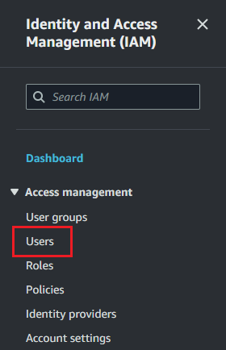
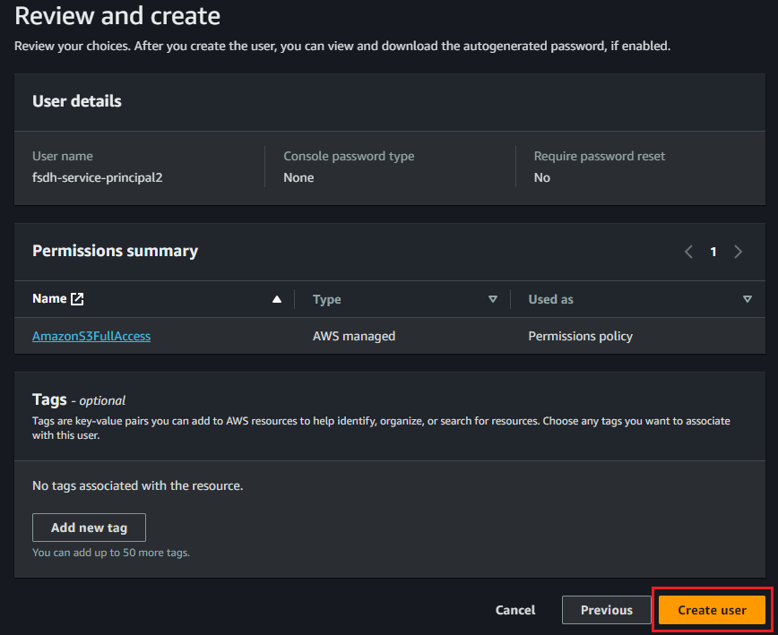
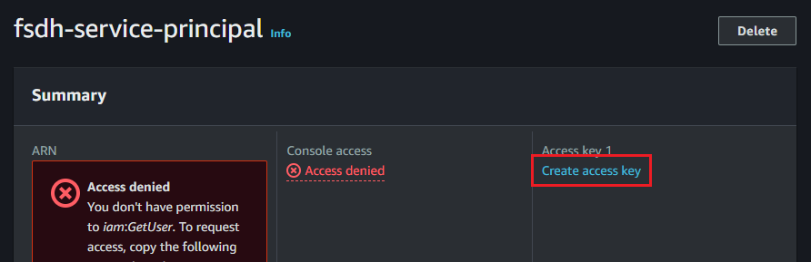
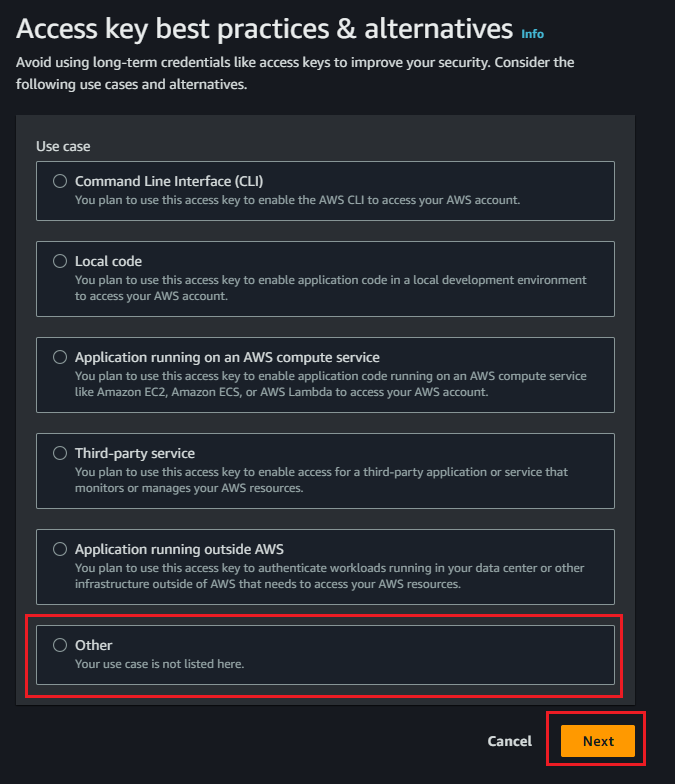
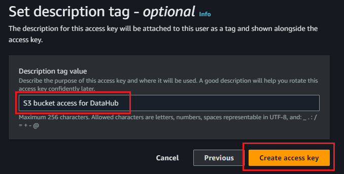
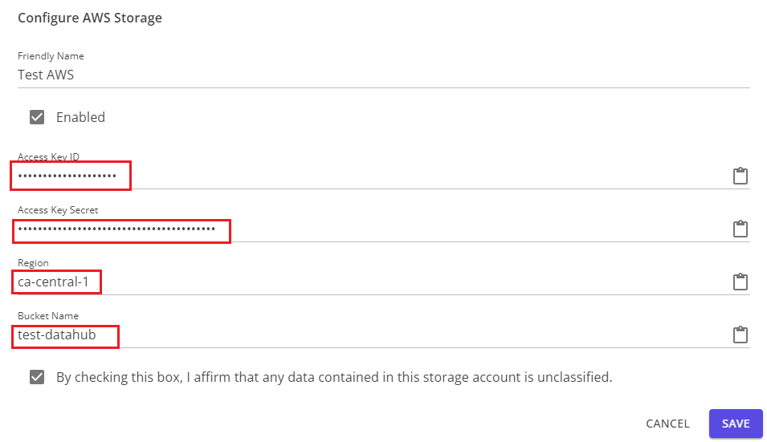

# Importation d'un Bucket AWS S3 existant

Pour importer un seau AWS S3, vous devez créer un utilisateur disposant des autorisations appropriées sur le seau et générer une clé d'accès pour cet utilisateur.

1. Dans le menu **Services** de la console AWS, accédez à **Sécurité, Identité et Conformité** et **IAM** dans cette section.  
IAM dans le menu de service](import_aws-01.png)

2. Dans la section **Utilisateurs**, créez un nouvel utilisateur.  



3. Dans l'étape **Set permissions** de la création d'un utilisateur, attribuez une politique appropriée à l'utilisateur. **AmazonS3FullAccess** donnera tous les droits à l'utilisateur, mais une politique plus restrictive, telle que l'exemple ci-dessous, peut être plus appropriée pour votre organisation.  

```
{
    "Version" : "2012-10-17",
    "Déclaration" : [
        {
            "Effet" : "Autoriser",
            "Principal" : "*",
            "Action" : [
                "s3:GetObject",
                "s3:PutObject",
                "s3:DeleteObject",
                "s3:ListBucket"
            ],
            "Ressource" : [
                "arn:aws:s3:::<nom-de-votre-bucket>/*",
                "arn:aws:s3:::<votre-nom-de-bucket>"
            ]
        }
    ]
}
```
Après avoir examiné les informations, cliquez sur **Créer un utilisateur** pour terminer cette étape.  


4. Une fois l'utilisateur créé, trouvez-le dans la liste des utilisateurs et cliquez sur le nom d'utilisateur. Dans la section **Résumé**, sous **Clé d'accès 1**, cliquez sur **Créer une clé d'accès**.



5. Sélectionnez **Autre** comme cas d'utilisation. Si vous le souhaitez, définissez une description pour la clé afin de l'identifier facilement, puis cliquez sur **Créer une clé d'accès**



6. Une fois la clé créée, veillez à copier la **clé d'accès** et la **clé d'accès secrète**. Vous ne pourrez pas récupérer la clé secrète après avoir quitté cet écran et devrez en créer une nouvelle si vous la perdez.  


Vous pouvez maintenant saisir ces informations, ainsi que le nom du seau et la région, dans la boîte de dialogue de configuration de Datahub.  

