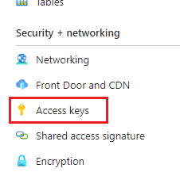
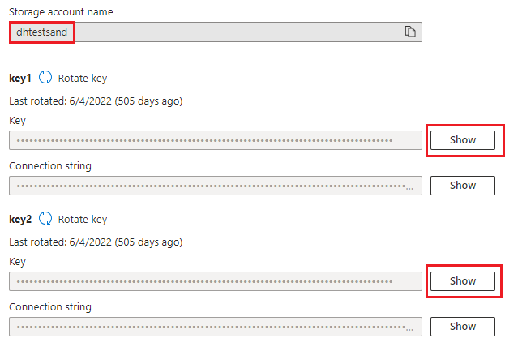
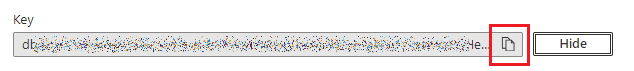

# Importation d'un compte de stockage Azure existant

L'importation de votre propre compte Azure Storage dans l'interface de l'explorateur de fichiers de Datahub est assez simple. Vous avez seulement besoin du nom du compte et d'une clé d'accès pour le configurer. Pour obtenir ces informations, suivez les étapes suivantes.

1. Naviguez jusqu'au compte de stockage dans votre portail Azure et sélectionnez **Clé d'accès** dans la section **Sécurité + réseau** du menu de gauche.  

2. Notez le **Nom du compte de stockage** - il devra être saisi dans la boîte de dialogue de configuration du compte dans Datahub. Pour la clé d'accès, vous pouvez utiliser l'une ou l'autre des clés. Si la clé utilisée fait l'objet d'une rotation (c'est-à-dire qu'une nouvelle clé est générée pour la remplacer), la configuration dans Datahub devra être mise à jour. Cliquez sur le bouton **Afficher** à côté de la clé que vous souhaitez utiliser.  

3. Lorsque la clé est révélée, vous pouvez utiliser le bouton **Copier dans le presse-papiers** pour copier la clé.  

Le **nom du compte de stockage** et la **clé du compte** peuvent maintenant être saisis dans le dialogue de stockage Azure.  

