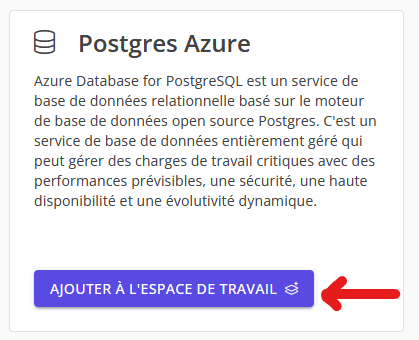
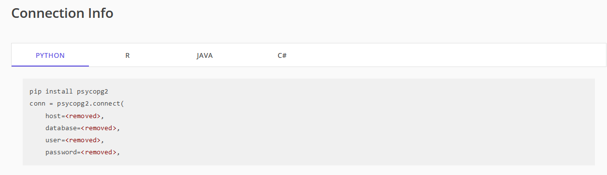

# Créer et utiliser une base de données PostgreSQL sur le DHSF

Le DataHub scientifique fédéral offre la possibilité de provisionner une base de données PostgreSQL pour votre espace de travail. Ce guide vous guidera à travers le processus de création d'une base de données PostgreSQL et son utilisation dans le code.

## Comment approvisionner une base de données PostgreSQL

1. Naviguez vers l'espace de travail dans lequel vous souhaitez créer une base de données PostgreSQL.
2. Naviguez vers la boîte à outils sous la catégorie "Administration".

3. Dans quelques minutes, la base de données sera provisionnée et vous la verrez dans la boîte à outils. Si la base de données n'est pas provisionnée, veuillez remplir une demande de support.

## Comment utiliser votre base de données PostgreSQL

1. Naviguez vers l'espace de travail dans lequel vous souhaitez utiliser la base de données PostgreSQL.
2. Naviguez vers l'onglet `Base de données SQL` sous la catégorie `Outils de l'espace de travail`. Cette page vous fournit les informations nécessaires pour vous connecter à votre base de données.
3. **Avant d'essayer d'utiliser la base de données**, vous devez ajouter votre adresse IP aux règles du pare-feu. 
    * Naviguez jusqu'au bas de la page et cliquez sur "Ajouter l'adresse IP actuelle" pour ajouter votre adresse IP locale aux règles du pare-feu.
    * Si vous changez de réseau ou basculez votre VPN, vous devrez ajouter votre nouvelle adresse IP aux règles du pare-feu.
    * Pour donner à Databricks l'accès à la base de données, vous devrez ajouter l'adresse `0.0.0.0` aux règles du pare-feu.
    * **NOTE:** L'application des changements peut prendre jusqu'à 15 minutes.

4. Après avoir ajouté votre adresse IP aux règles du pare-feu, vous pouvez utiliser les informations de connexion fournies pour Databricks, Python, R, Java et C#.
