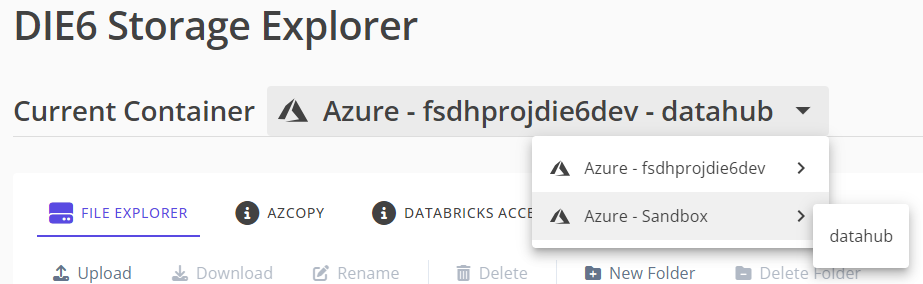

# Stockage d'importation

Outre le compte de stockage Azure par défaut généré pour chaque espace de travail, des comptes de stockage externes peuvent être importés. Cela permet aux utilisateurs d'accéder à ces ressources dans Datahub à l'aide de Storage Explorer.

Les administrateurs de l'espace de travail ont accès à des options de menu dans le sélecteur de stockage pour ajouter, modifier et supprimer des comptes de stockage en nuage en plus du conteneur de stockage Azure par défaut pour l'espace de travail.  

Les utilisateurs non administrateurs verront un menu similaire si l'espace de travail a plus d'un conteneur de stockage disponible. Ils peuvent naviguer entre les conteneurs de stockage, mais n'ont pas la possibilité de les gérer. Si seul le conteneur par défaut est disponible dans l'espace de travail, le menu est omis.  

## Configuration du compte de stockage

Lorsque vous ajoutez ou modifiez un compte de stockage, cette boîte de dialogue s'affiche :  

1. Le **Nom convivial** s'affichera dans le sélecteur de stockage s'il est défini. Sinon, le sélecteur de stockage et le menu afficheront le nom du compte (Azure, GCP) ou le nom du bucket (AWS).
2. Le compte doit être **activé** pour pouvoir être utilisé dans l'explorateur de fichiers. Les comptes nouvellement ajoutés sont activés par défaut, mais s'il y a une erreur d'accès au compte, ils seront automatiquement désactivés et devront être réactivés par un administrateur.
3. Les identifiants de connexion sont spécifiques à chaque fournisseur de services en nuage. Pour plus de détails, veuillez consulter les pages suivantes :
    - [Importation du stockage Azure](/fr/UserGuide/Storage/Importer-le-stockage-Azure.md)
    - [Importation du stockage AWS](/fr/UserGuide/Storage/Importer-le-stockage-AWS.md)
    - [Importation du stockage Google Cloud Platform](/fr/UserGuide/Storage/Importer-le-stockage-GCP.md)
4. Avant d'ajouter un fournisseur de stockage en nuage, vous devez vous assurer qu'il ne contient pas de données classifiées en cochant cette case.
